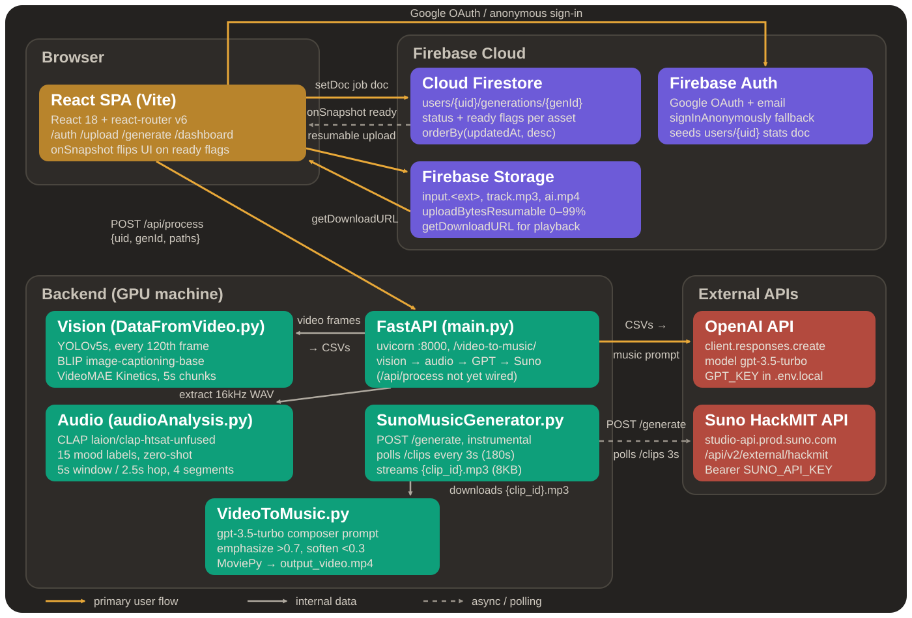

# Nosu — AI Soundtracks for Every Scene

  

**HackMIT 2025**

---

## System Architecture

## What is Nosu?

**Nosu** turns any short video into a perfectly-timed, royalty-free AI soundtrack — then merges it back into a shareable MP4. No music theory. No licensing headaches. Just upload and go.

### The Problem

Creating background music for short-form video is painful. You either scroll through generic stock libraries hoping something fits, pay a composer, or risk a copyright strike. None of these options understand *what's actually happening* in your video.

### The Solution

Nosu watches your video the way a film composer would — identifying objects, reading scenes, and understanding the mood of every moment. It then translates that visual understanding into a precise music prompt, generates a custom soundtrack via Suno AI, and delivers a ready-to-share MP4 with the audio baked in.

The entire pipeline runs **three vision models locally** (YOLO v5, BLIP, VideoMAE) plus **CLAP audio mood classification**, fuses their outputs with confidence-weighted scoring per time interval, and uses GPT to distill that analysis into a concise music generation prompt.

---

## Tech Stack

  

### Frontend
- **React 18 + Vite** — SPA with client-side routing
- **Tailwind CSS** — Utility-first styling
- **Firebase SDK** — Auth, Firestore, Storage
- **Axios** — HTTP client for backend communication

### Backend
- **Python + FastAPI** — Async API server
- **MoviePy + FFmpeg** — Audio extraction and video muxing (H.264/AAC)
- **Hugging Face Transformers** — Local inference for BLIP, VideoMAE, CLAP
- **YOLOv5 (PyTorch Hub)** — Real-time object detection per frame
- **OpenAI SDK** — GPT-powered music prompt generation
- **Suno API** — AI music generation

### Infrastructure
- **Firebase Firestore** — NoSQL database for user data and generation metadata
- **Firebase Authentication** — Email + Google OAuth
- **Firebase Storage / GCS** — Video, audio, and CSV artifact storage

---

## How It Works

  

### 1. Upload → Firebase Storage
User selects a video. The frontend uploads it to a deterministic path (`users/{uid}/generations/{genId}/input.<ext>`) and creates a Firestore job document to track the generation.

### 2. Multi-Model Video Analysis
The backend runs **three vision models in sequence** on the uploaded video:

| Model | Task | Output |
|-------|------|--------|
| **YOLOv5** | Object detection per frame | `frame_metadata.csv` — detected objects + confidence per timestamp |
| **BLIP** | Image captioning per frame | `detail_frame_metadata.csv` — natural language scene descriptions |
| **VideoMAE** | Action/scene classification per chunk | `scene_timeline.csv` — Kinetics-400 action labels + confidence per 5s segment |

All three models run **locally on-device** (GPU preferred, CPU fallback) — no external API calls for the vision pipeline.

### 3. Confidence-Weighted Prompt Generation
The three CSV outputs are aggregated and sent to **GPT** with a system prompt that instructs it to act as a film composer: convert visual scene descriptions into a concise music prompt (mood, genre, instrumentation, tempo). Each descriptor is weighted by its confidence score per time interval.

### 4. AI Music Generation
The music prompt is sent to **Suno AI** which generates a custom instrumental track. The backend polls until the clip is ready, then downloads the MP3.

### 5. Audio/Video Merge
**MoviePy** handles the final mux: the generated audio is looped or trimmed to match the video duration, then merged into a single MP4 (H.264 video + AAC audio).

### 6. Download
The user gets two download options via signed Firebase Storage URLs:
- **Track only** — `track.mp3` (the AI-generated soundtrack)
- **AI Video** — `ai.mp4` (original video + generated soundtrack)

---

## Features

- **Email + Google Auth** — Firebase Authentication with `ensureUserDoc` on first sign-in
- **Video Upload & Job Tracking** — Real-time progress (0–100%) via Firestore listeners
- **Multi-Model Vision Analysis** — YOLO objects, BLIP captions, VideoMAE scene labels
- **Audio Sentiment Analysis** — CLAP zero-shot mood classification on extracted audio
- **LLM Prompt Engineering** — GPT condenses multi-modal analysis into a Suno-optimized music prompt
- **AI Soundtrack Generation** — Suno produces custom instrumental tracks (royalty-free)
- **Automatic Audio/Video Mux** — Loop, trim, and merge with MoviePy (H.264 + AAC output)
- **Download Options** — Separate track (MP3) or merged video (MP4) via signed URLs
- **Dashboard** — Generation history with search, ordered by last update

---

## License

This project is licensed under the MIT License — see the [LICENSE](LICENSE) file for details.
